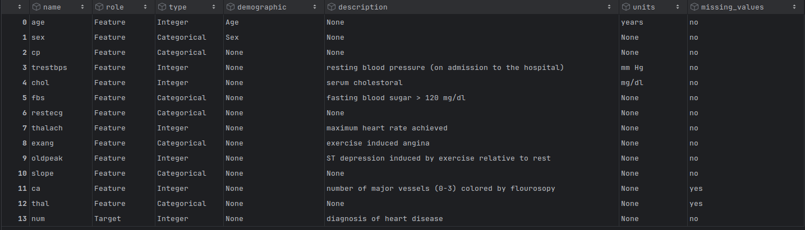

## Final Project - Heart Disease Prediction - Classification with Logistic Regression

Heart disease kills about a million people each year. 
Predicting if someone has heart disease early on can potentially save thousands of lives.

Thus, the goal of this project is to pick, build, and optimize a supervised learning model 
that can reliably predict if someone has heart disease.

### Learning Type: 
Supervised Learning

### Task:
Binary classification

### Algorithms:
* Logistic Regression
* Random Forest
* Support Vector Machine
* Gradient Boosting
* K Nearest Neighbors

### Data
Heart Disease Dataset from UC Irvine (Machine Learning Repository).

#### Additional Info About the Data (from UC Irvine Website)

4 databases: Cleveland, Hungary, Switzerland, and the VA Long Beach

* Dataset Characteristics: Multivariate
* Subject Area: Health and Medicine
* Associated Tasks: Classification
* Feature Type: Categorical, Integer, Real
* Instances: 303
* Features: 13

#### Features

### References
#### Dataset
* Janosi, A., Steinbrunn, W., Pfisterer, M., & Detrano, R. (1989). \
Heart Disease [Dataset]. UCI Machine Learning Repository. https://doi.org/10.24432/C52P4X.

#### AI Help with Project Planing
*   Google. (2025). *Gemini* [Large language model]. gemini.google.com
